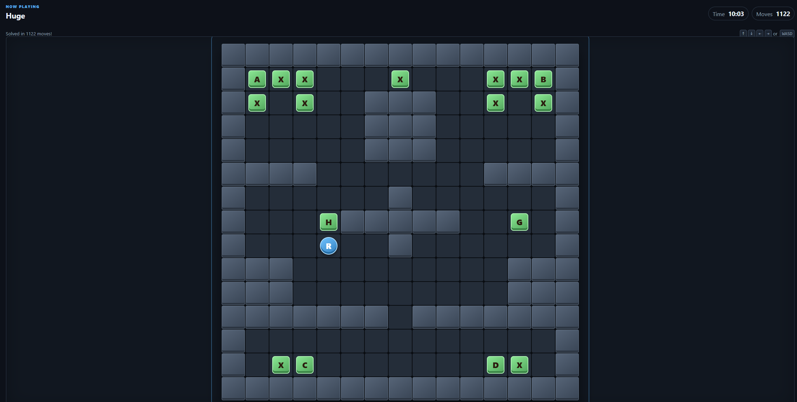

# Sokomind

Sokomind is a Sokoban variant with generic and letter-matched boxes, playable
as either a Python desktop application or a static browser game. It also
includes classic DFS/BFS/Greedy/A* solvers plus **Ultimate Search**, a
Sokoban-specific portfolio using push-level search, dead-square pruning, robot
reachability canonicalization, exact distinct goal assignment, and push-distance
heuristics. Its web search distinguishes temporary, conditional, and provably
packed goal placements using state-complete room/corral, doorway, exact matching,
and recursively proven support evidence. Guided searches keep proven boxes fixed
while ordering strategic pushes with dynamic support dependencies and dense,
proof-complete exact searches of small rooms and corrals. Typed doorway-flow
analysis also schedules particular-box imports and exports across shared
corridors, simultaneous transfers, and required gate or staging restoration.
Assignment, dependency, bottleneck, recent-action, doorway, and restoration
signals share one completeness-preserving relevance order. Optional expensive
signals are paused per worker when they stop producing useful downstream
progress, while proof evidence always remains active. Bounded relaxed multi-box room and
chokepoint-pair tables strengthen the admissible assignment heuristic when they
prove unavoidable box interaction cost. Guided beams reserve bounded feature-space
cells for distinct room, gate, packing, dependency, detour, and mobility states.

- [Desktop application setup and usage](docs/DESKTOP.md)
- [Web application documentation](docs/README.md)
- [Solver architecture and puzzle-independence rules](docs/ARCHITECTURE.md)
- [Forward development roadmap](docs/ROADMAP.md)

## Repository layout

- `searches/`: Python solver, desktop application, and compatibility CLIs
- `docs/`: browser application and project documentation
- `tests/`: Python and real-browser integration tests
- `bench/`: deterministic benchmarks, profilers, and solution verification
- `shared/`: cross-runtime puzzle and rule fixtures
- `scripts/`: repository quality and build checks
- `data/`: documentation and benchmark media

Run the automated solver tests with:

```powershell
python -m unittest discover -v
npm run test:unit
npm run check:build
npm run check:quality
node bench/performance-gate.js
node bench/verify-solution.js huge docs/optimalForHuge.txt
npm ci
npx playwright install chromium webkit
npm run test:browser
```

On Windows, use `py -m unittest discover -v` if `python` is not on PATH.
Supported development runtimes are Python 3.10 or newer and Node 20 through 24.
The Playwright suite serves `docs/` itself and exercises Chromium and WebKit.

The canonical level catalog and cross-runtime parsing/rule cases live in
`shared/sokomind-conformance.json`. Python loads its built-in levels from this
file; browser-embedded levels and benchmark replay rules are checked against the
same fixtures in CI.


## Saved Huge diagnostic solution

The saved route is a replay-valid regression artifact used to study difficult
states and pruning behavior. It is never consumed by the solver and is not a
puzzle-specific shortcut. Verify it with:

```powershell
node bench/verify-solution.js huge docs/optimalForHuge.txt
```


